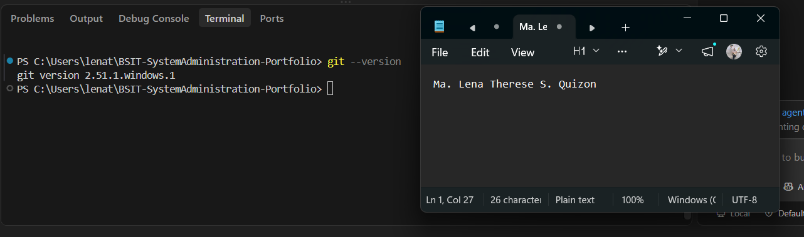
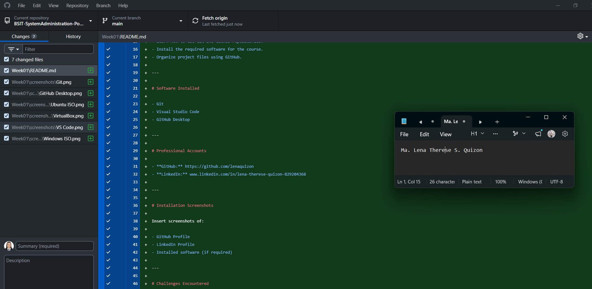
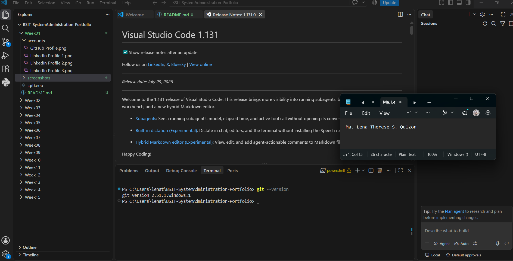
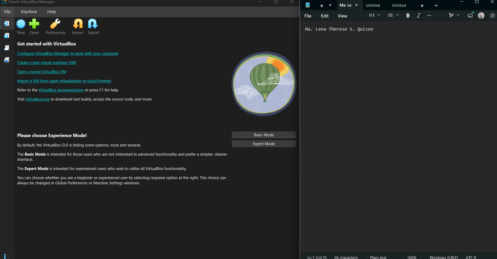
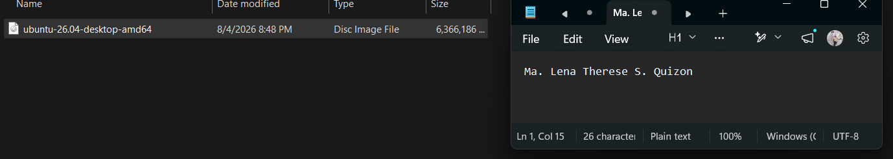
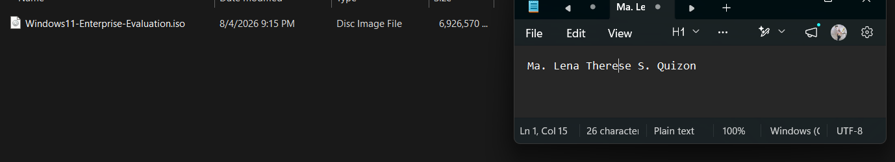

# Week 1 – Building My Professional Environment

## Student Information

- **Name:** Ma. Lena Therese S. Quizon
- **Course:** Bachelor of Science in Information Technology
- **Section:** BSIT 4A
- **Date:** August 2026

---

# Objectives

- Develop a strong foundation in system administration and computer system management.
- Gain practical experience using industry-standard tools and software for system administration.
- Improve proficiency in version control and project organization using Git and GitHub.
- Build the skills needed to install, configure, and manage operating systems in virtual environments.
- Apply best practices in organizing, documenting, and maintaining technical projects throughout the course.

---

# Software Installed

- Git
- Visual Studio Code
- GitHub Desktop
- VirtualBox
- Ubuntu ISO
- Windows ISO

---

# Professional Accounts

- **GitHub:** https://github.com/lenaquizon
- **LinkedIn:** www.linkedin.com/in/lena-therese-quizon-829204368

---

# Installation Screenshots

## Git

## GitHub Desktop

## Visual Studio Code

## VirtualBox

## Ubuntu ISO

## Windows 11 Enterprise Evaluation ISO

---

# Challenges Encountered

### 1. Slow and interrupted downloads

Some of the required installation files were large, causing the downloads to take a long time. One of the downloads was interrupted, so I switched to a different browser to complete it successfully.

### 2. Managing large installation files

The Ubuntu and Windows ISO files occupied several gigabytes of storage. I organized the files into a dedicated folder to make them easier to locate for future laboratory activities.

### 3. Setting up the required development environment

Installing multiple software applications and organizing the required project folders took time and careful attention. I verified each installation and organized the files according to the required repository structure.

---

# Reflection
Doing this activity made me realized that even if you know for yourself, all of the capabilities you have, it is also important to build up your portfolios online and showcase those capabilities, so that companies and employers how a basis when looking at your profile. Having a professional online presence on platforms like LinkedIn and GitHub are very important, especially for someone that hopes to work in the IT industry in the future. GitHub allows recruiters to view your public projects, and see how good and proficient you are with your work. Meanwhile, LinkedIn will be the platform that will allow recruiters to learn more about your background, education, technical skills, certifications, and other experiences. It also enables me to build up connections with professionals in the industry, and be informed with job opportunities. By building up my online profile, it increases my chance of being noticed by potential recruiters in the future.

Other than building your online presence. I got to learn how to install other important softwares like VirtualBox, Ubuntu ISO, and the Windows ISO that will help me during labortaory activities, assignments, and future projects. Setting these applications gave me a better insight of the software and environments used in system administration. Being able to become familiar with these tools in this course will help me complete future exercises more efficiently and develop the skills needed to become competent in system administration.

---

# References

### Windows ISO Download
https://www.microsoft.com/en-us/evalcenter/download-windows-11-enterprise

### GitHub Desktop Installer
https://desktop.github.com/download/

### Ubuntu ISO Installer
https://ubuntu.com/download/desktop

### VirtualBox Installer
https://www.virtualbox.org/ 

---