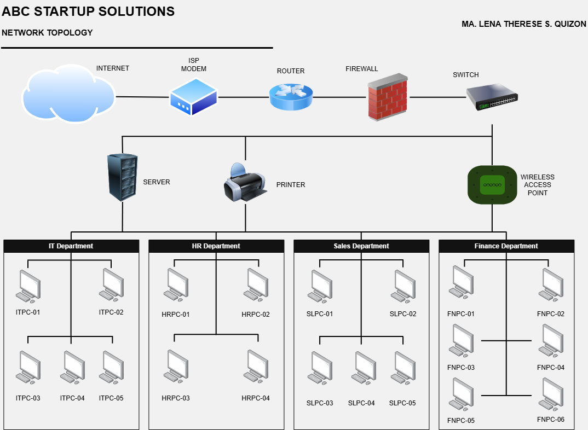

# Enterprise Infrastructure Plan – ABC Startup Solutions

## Project Overview

Every successful IT infrastructure begins with proper planning. 
Before purchasing computers, installing servers, configuring networks, or deploying 
cloud services, a System Administrator must first understand the organization's 
business requirements and design an infrastructure that supports business 
operations. 
In this project, you will assume the role of a Junior System Administrator 
assigned to prepare the initial IT Infrastructure Plan of a newly established startup 
company. 
Your final output should resemble a professional document that could be 
submitted to an IT Manager or Company Executive.  

## Learning Objectives

At the end of this project, students should be able to:  
### Knowledge  
• Explain the roles and responsibilities of a System Administrator.  
• Identify the hardware, software, and networking requirements of a small 
business.  
• Describe the purpose of IT documentation and infrastructure planning.  
### Skills  
Students will be able to:  
• Analyze organizational IT requirements.  
• Prepare professional IT inventories.  
• Design an enterprise network topology.  
• Create technical documentation using Markdown.  
• Present infrastructure planning professionally.  
### Attitude  
Students are expected to demonstrate:  
• Professionalism  
• Organization  
• Technical communication  
• Attention to detail  
• Critical thinking 

## Company Scenario

You have recently been hired as the Junior System Administrator of ABC Startup Solutions, a newly established software development company.

The company currently has 20 employees and occupies a single office floor. Management has requested that you prepare the complete IT Infrastructure Plan before purchasing equipment.

The company consists of the following departments:

| Department | Employees |
|---|---:|
| Information Technology | 5 |
| Human Resources | 4 |
| Finance | 5 |
| Sales | 6 |
| **TOTAL** | **20** |

The company currently has:
- No computers
- No server
- No network
- No internet infrastructure
- No security policies

Your task is to design everything from scratch.

## Hardware Inventory Summary

The proposed hardware infrastructure includes employee computers, server equipment, network devices, storage, power protection, and shared peripherals.

| Hardware | Quantity | Purpose |
|---|---:|---|
| Desktop Computers | 15 | Employee workstations |
| Laptops | 5 | Work mobility |
| Server | 1 | Centralized services and hosting |
| Router | 1 | Network routing and internet connectivity |
| Switch | 1 | Connects wired network devices |
| Printer | 1 | Shared printing, scanning, and photocopying |
| UPS | 2 | Power protection |
| Wireless Access Point | 1 | Wireless connectivity |
| NAS Storage | 1 | Centralized storage and backups |
| External Backup Drives | 2 | Additional data backups |
| Monitors | 20 | Employee displays |

## Software Inventory Summary

The proposed software provides the company with operating systems, productivity applications, development tools, security features, and utilities.

| Software | Purpose |
|---|---|
| Windows 11 Pro | Main operating system for employee computers |
| Ubuntu Server | Main server for hosting services, apps, databases, and other services. |
| Microsoft 365 | Productivity and communication |
| Visual Studio Code | Software development and code editing |
| Git | Source code version control |
| GitHub Desktop | Git and GitHub management |
| VirtualBox | Manage virtual machines |
| Google Chrome | Web browsing and web-based services |
| Microsoft Defender | Protection against security threats |
| AnyDesk | Remote access to devices |
| 7-Zip | File compression and extraction |

## Embedded Network Diagram

The network topology was created using **[Draw.io (diagrams.net)](https://www.diagrams.net/)**. It shows the connection between the internet, network devices, server, printer, wireless access point, and the four departments.

## Technologies Used

- **Microsoft Word** – Documentation and final infrastructure plan
- **Draw.io** – Diagram design
- **GitHub** – Used to store and document the project repository
- **Visual Studio Code** – Used to create and edit the README.me file

## Challenges Encountered

One of the main challenges I've encountered was determining the appropriate devices and components that realistically fits the number of employees the company has. Another challenge was designing the network topology to determine how those devices should be connected. 

## Reflection

The making of this helped me get a better understanding on how important the role of a system administrator is. I learned how important it is to properly plan an organization’s IT infrastructure based on what the company’s needs. Planning the whole hardware, software, and the network inventories gave me a better understanding how devices and technologies play a key role in an organization.

## References

### Ubuntu Version Information
https://ubuntu.com/download/desktop

### VirtualBox Version Information
https://www.virtualbox.org/wiki/Downloads

### Google Chrome Version Information
https://www.whatismybrowser.com/guides/the-latest-version/chrome#google_vignette

### Microsoft Defender Version Information
https://www.microsoft.com/en-us/wdsi/defenderupdates

### AnyDesk Version Information
https://anydesk.com/en/downloads/windows

### 7-Zip Version Information
https://www.7-zip.org/download.html

### Helpdesk Technician Roles
Responsibilities: https://www.auxilion.com/insights/help-desk-technician-role-and-responsibilities  Skills: https://www.indeed.com/career-advice/resumes-cover-letters/help-desk-skills  Common Tools: https://coursecareers.com/blog-posts/8-essential-it-support-tools  Certifications: https://www.beyondtrust.com/blog/entry/5-must-have-certifications-for-support-professionals

### Network Administrator Roles
Responsibilities/Skills: https://www.indeed.com/career-advice/finding-a-job/what-are-responsibilities-of-network-administrator  
Common Tools: https://www.spiceworks.com/it-articles/network-admin-tools/  
Certifications: https://www.indeed.com/career-advice/career-development/top-network-administrator-certifications  

### Linux System Administrator
Responsibilities/Tools: https://www.geeksforgeeks.org/linux-unix/what-is-linux-system-administration/  
Skills: https://www.redhat.com/en/blog/skills-linux-sysadmin  
Certifications: https://www.tealhq.com/career-paths/ linux-system-administrator-certifications#top-linux-system-administrator-certifications  

### Cloud Administrator
Responsibilities/Skills: https://in.indeed.com/career-advice/finding-a-job/cloud-administrator-responsibilities  
Tools: https://www.stackroutelearning.com/key-tools-and-technologies-every-cloud-administrator-should-master/  
Certifications: https://www.ascendientlearning.com/blog/top-it-cloud-certifications-for-cloud-professionals  

### Infrastructure Recommendations
https://alphadc.net/blog/review/best-specification-for-server/  
https://www.avepoint.com/blog/backup/3-2-1-backup-rule#what-is-the-3-2-1-backup-rule