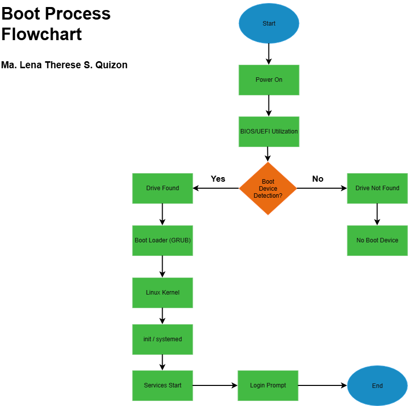

# Week 03: Portfolio Project Enterprise Server Deployment and Operating System Installation 

## Project Overview
Operating systems form the core foundation of enterprise IT infrastructure, enabling servers to host web services, databases, and business applications. In this project, acting in the role of a Junior System Administrator, an Ubuntu Server instance was deployed and configured for a startup environment. This documentation covers the end-to-end deployment process, including operating system installation, post-install configuration, system verification, and a technical comparison of modern boot architectures.

---

## Learning Objectives
After completing this project, students should be able to: 
### Knowledge 
Students should be able to: 
1. Explain the purpose of an operating system in enterprise environments. 
2. Differentiate BIOS and UEFI firmware. 
3. Explain the stages of the computer boot process. 
4. Compare Ubuntu Server, Windows Server, and Rocky Linux. 
### Skills 
Students should be able to:  
• Install Ubuntu Server in a virtual machine.  
• Configure server settings during installation.  
• Enable secure remote administration using SSH.  
• Verify server functionality.  
• Document installation procedures.  
• Produce professional technical documentation.  
### Professional Outcomes 
By the end of this activity, students will have:  
• Installed Ubuntu Server  
• Configured a working Linux server  
• Produced a deployment guide  
• Created installation documentation  
• Updated their GitHub portfolio  
• Published a LinkedIn learning reflection  

---

## Virtual Machine Specifications

| Feature | Specification |
| :--- | :--- |
| **Hypervisor** | VirtualBox |
| **Guest OS** | Ubuntu 25.04 LTS (or specified distro) |
| **vCPUs Assigned** | 2 Cores |
| **RAM Allocated** | 4 GB (4096 MB) |
| **Virtual Disk Size** | 40 GB |
| **Network Adapter** | NAT |

---

## Installation Summary
1. **Hypervisor Provisioning:**
• Launched Oracle VM VirtualBox and selected New. 
• Defined VM Name as Ubuntu-Server-Week03 and attached the Ubuntu Server 25.04 ISO. 
• Allocated 4 GB RAM, 2 vCPUs, and a 40 GB dynamic virtual disk. 
• Configured the primary network adapter to NAT. 

2. **System Setup & Profile Configuration:**
   * Booted the VM and selected Ubuntu Server from the installation menu.
   * Configured primary language and keyboard layout to English (US).
   * Selected standard Ubuntu Server (Default) base package set.
   * Set up system credentials and profile parameters:
     * Administrator Name: YourName
     * Hostname: server01
     * Username: quizon
     * Password: Standard secure password
   * Enabled Install OpenSSH Server for remote administration capabilities.

3. **Finalization & Reboot:**
• Completed core package installation and selected Reboot Now.

---

## Configuration Summary
* **Hostname:** server01
* **Administrative Account:** quizon 
* **Primary Network Interface:** enp0s3 
* **Remote Access Service:** OpenSSH Server 

---

## Verification Results

1. **Host Identity Verification** 
• Command: hostname 
• Expected Result: Output displays **server01**, matching assigned system identity.

2. **Network IP Assignment** 
• Command: ip addr 
• Expected Result: Displays **enp0s3** interface with an assigned IPv4 address under the inet attribute.

3. **Outbound Network Connectivity** 
• Command: ping -c 4 google.com 
• Expected Result: Transmits 4 ICMP packets returning 0% packet loss, confirming active internet access and functional DNS resolution. 

4. **Package Manager Synchronization** 
• Command: sudo apt update && sudo apt upgrade -y  
• Expected Result: Synchronizes package lists successfully and upgrades outdated packages without broken dependencies.

5. **OpenSSH Service Daemon Status** 
• Command: systemctl status ssh  
• Expected Result: active (running) in green text. 

---

## BIOS vs UEFI Highlights

### Overview & Key Differences

| Feature | BIOS (Basic Input/Output System) | UEFI (Unified Extensible Firmware Interface) |
| :--- | :--- | :--- |
| **Definition** | Traditional firmware providing low-level hardware control to the OS. | Modern, flexible firmware acting as a lightweight mini-operating system. |
| **Boot Process** | POST → Checks boot order → Loads **MBR** → Executes bootloader → Boots OS. | Initialized drivers → Reads NVRAM `BootOrder` → Loads EFI bootloader from **ESP** → Boots OS. |
| **Partition Style** | Master Boot Record (**MBR**) | GUID Partition Table (**GPT**) |
| **Max Disk Support** | **2.2 TB** (standard 512-byte sector sizing) | **9.4 ZB** (~9.4 billion TB) |
| **Execution Mode** | 16-bit Real Mode | 32-bit or 64-bit Mode |
| **Security Features** | Minimal (basic supervisor/power-on passwords) | Advanced (**Secure Boot** via cryptographic key validation) |
| **Advantages** | Broad legacy compatibility | Faster boot times, native mouse/GUI support, modular drivers, networking capabilities. |
| **Disadvantages** | Severe storage limits, slow POST sequence, security vulnerabilities. | Requires system/firmware compatibility; complex implementation. |
| **Modern Usage** | Obsolete; reserved for legacy hardware | Standard on all modern PCs and server platforms |

---

## Boot Process Flowchart

---

## Challenges Encountered
1. **Large Download Size and Network Connectivity**  
•	One of the major problems was the download size of the needed files. The Windows Server file was around 7.6 GB, considering how large the file was it took a while to download it.  
2. **APT Archive Download Failure**  
•	When doing the ‘sudo apt upgrade’ command, it failed and showed a “Failed to fetch”. The terminal also showed a 403 Forbidden error.

---

## Reflection
Setting up a virtual environment was a bit overwhelming at first, especially when you aren't familiarized with platforms like VirtualBox. Seeing the interface, mainly for the Ubuntu Server ISO, it was unfamiliar due to it not having a full graphial interface. It was only text-based which I'm not used to. 

The installation process was somewhat easier since our instructor also gave what we should pick with the configurations. If there were parts that was a bit confusing, I did end up consulting chatbots to help me navigate through the configuration process. However, when the installation was completed, it ended up being quite easy. The experience taught me how to create and install a new virtual machine, and adjust the needed configurations for the activity. 

In the end, setting up the virtual machine started from being an overwhelming task, to somewhat a valuable learning experience. It enabled me to explore VirtualBox and understand how virtualization works. With this experience, I hope that I could further practice more on virtual machines and be able to manage different operating systems in the future.

---

## References

### BIOS: 
•	https://www.lenovo.com/ph/en/glossary/what-is-a-bios/ 
### UEFI: 
•	https://www.hp.com/hk-en/tech-takes/software/explainer/what-is-uefi.html  
•	Max Disk Drive/Partition Style: https://uefi.org/sites/default/files/resources/UEFI_Drive_Partition_Limits_Fact_Sheet.pdf  
•	https://www.techtarget.com/whatis/definition/Unified-Extensible-Firmware-Interface-UEFI 
### BIOS History: 
•	https://zachary-brown.com/blog/bios/  
•	https://medium.com/@pratham.tomar23/understanding-bios-the-hidden-brain-that-boots-your-computer-969c35ce2707  
### Windows Server: 
•	https://learn.microsoft.com/en-us/windows-server/get-started/overview  
•	https://blog.webhostingworld.net/the-pros-and-cons-of-different-server-operating-systems/ 
### Ubuntu Server: 
•	https://ubuntu.com/server  
•	https://dev.to/regoanac/pros-and-cons-of-ubuntu-exploring-advantages-and-disadvantages-of-the-linux-operating-system-2a4m
### Rocky Linux: 
•	https://tuxcare.com/blog/rocky-linux-vs-ubuntu/  
### VirtualBox Manual: 
•   https://www.virtualbox.org/manual/topics/create-vm.html